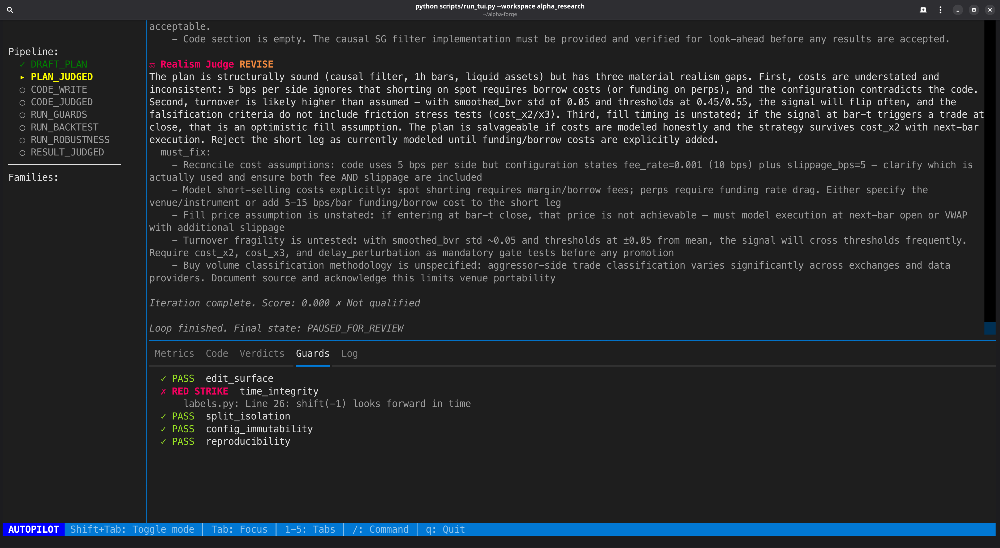
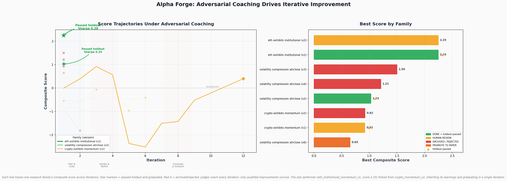
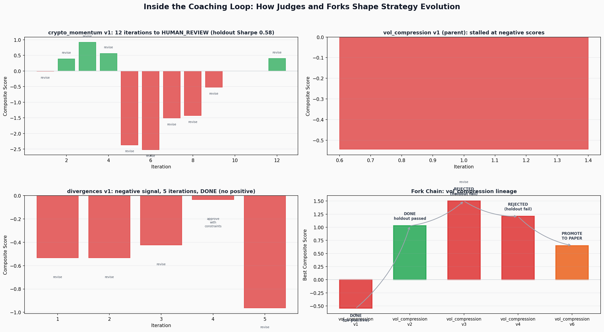
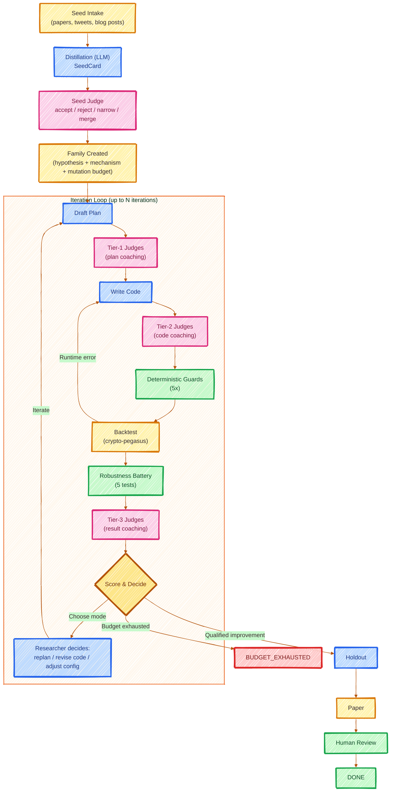
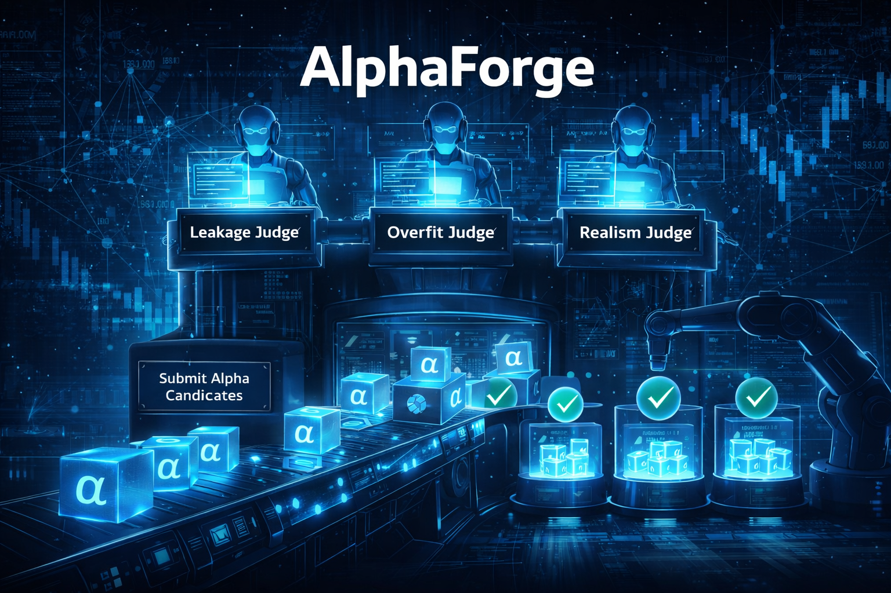

<p align="center">
  
</p>

<h3 align="center">Adversarial, Mutation-Bounded Crypto Alpha Research Loop</h3>

<p align="center">
  <em>File-native state &bull; Coaching LLM judges &bull; Deterministic guards &bull; Fractional sizing &bull; Engine-level risk management</em>
</p>

---

Alpha Forge is an autonomous research system that discovers, validates, and hardens crypto trading strategies. Every idea is coached by specialized LLM judges, checked by deterministic guards, and stress-tested through a robustness battery before it can graduate. Judges never reject — they coach. Families iterate until they succeed or exhaust their budget. All state lives in Markdown + YAML files. No database. No black boxes.

## TUI Dashboard



A Textual-based terminal UI provides a real-time cockpit: live LLM token streaming, judge verdicts with color-coded severity, pipeline stage tracking, guard results, and autopilot/semi-auto mode toggle.

```bash
python scripts/run_tui.py --workspace alpha_research
```

## Results



*Each line traces one research family's composite score across iterations. Star markers = graduated via holdout. Red X = archived. Judges coach every iteration; only qualified improvements survive. The top performer (eth_institutional_momentum_v1, score 2.25) forked from crypto_momentum_v2, inheriting its learnings and graduating in a single iteration.*



*Inside the coaching loop: per-iteration scores with judge verdicts (green = qualified, red = revised), and the vol_compression fork chain showing iterative improvement from v1 (-0.54) through v2 (1.03, holdout passed) to v6 (promoting to paper).*

## Why Alpha Forge?

Manual quant research suffers from three failure modes:

1. **Unconstrained search** — researchers keep tweaking until something "works"
2. **Overfitting** — results look great on training data, die on holdout
3. **No audit trail** — impossible to trace how a strategy evolved

Alpha Forge addresses all three by treating alpha research as a **controlled experiment** with hard boundaries on what can change, coaching review at every stage, and a complete paper trail in human-readable files.

## Architecture



<p align="center">
  
</p>

## Coaching Judge Pipeline

Seven LLM judges organized in three tiers run concurrently via `ThreadPoolExecutor`. Judges act as **coaches, not gatekeepers** — they return `approve`, `approve_with_constraints`, or `revise` with specific, actionable `must_fix` feedback.

| Tier | Judges | Reviews |
|------|--------|---------|
| **Tier 1 — Plan** | Leakage, Overfit, Realism | Research plan before any code is written |
| **Tier 2 — Code** | Leakage, Code Smell | Implementation for data leaks, complexity, edit surface violations |
| **Tier 3 — Results** | Result, Overfit, Realism | Backtest metrics for overfitting, fragility, concentration |

| Judge | Focus |
|-------|-------|
| **Seed Judge** | Testability, mechanism coherence, duplication risk |
| **Leakage Judge** | Time leakage, label leakage, split contamination, lookahead |
| **Overfit Judge** | Result-chasing, hidden sweeps, degrees of freedom, family drift |
| **Realism Judge** | Fee realism, turnover, liquidity, slippage, latency |
| **Code Smell Judge** | Hidden state, complexity creep, edit surface violations |
| **Result Judge** | Concentration, fragility, stability, promotion worthiness |
| **Mutation Judge** | Mechanism preservation, search abuse, budget discipline |

## Iteration Model

- **No strikes, no rejections** — judges coach via `revise` verdicts with actionable feedback
- **Iteration budget** — each family gets up to 20 iterations (configurable). Budget exhaustion is the only iteration-based terminal condition
- **Researcher autonomy** — after each iteration, the researcher LLM chooses: `replan`, `revise_code`, or `adjust_config`
- **Rollback on severe degradation** — code rolls back to last checkpoint only if score drops below 80% of best
- **Clean history** — judges see only a windowed score trajectory, not accumulated failure history

## Deterministic Guards

Five hard guards (pure code, no LLM) run before every backtest. Failures route back to code revision for automatic repair:

| Guard | What it Checks |
|-------|---------------|
| **Edit Surface** | Only `research/*.py` files modified; forbidden files untouched |
| **Time Integrity** | No forward-looking operations, no future data in features |
| **Split Isolation** | Holdout data not accessed before promotion; splits immutable |
| **Config Guard** | SHA-256 hashes of config files unchanged |
| **Reproducibility** | Commit hash, config hashes, dataset version logged |

## Robustness Battery

Five stress tests after every backtest: cost perturbation (2x/3x fees), slippage perturbation (2x/3x), sub-period stability (3 windows), leave-one-asset-out, and shuffle placebo (randomized signal timing).

## Installation

**Prerequisites:** Python 3.12+, [crypto-pegasus](https://github.com/your-org/crypto-pegasus) backtest engine (sibling directory), LLM provider API keys.

```bash
git clone https://github.com/your-org/alpha-forge.git
cd alpha-forge

# Install dependencies (uses uv)
uv sync

# Install crypto-pegasus backtest engine
pip install -e ../crypto-pegasus

# Configure LLM providers
cp .env.example .env   # add your API keys
```

## Quick Start

```bash
# 1. Initialize workspace
python scripts/init_workspace.py --workspace alpha_research --configs configs --auto-splits

# 2. Ingest a seed idea
python scripts/intake_seed.py \
  --text "Funding rate mean-reversion on perpetual futures shows a 3-5 day half-life" \
  --source "Academic paper: Perpetual Futures Microstructure" \
  --workspace alpha_research \
  --auto-create

# 3. Run the research loop
python scripts/run_loop.py \
  --family fam_001 \
  --workspace alpha_research \
  --configs configs \
  --max-iterations 20
```

### Other commands

```bash
python scripts/run_iteration.py --family fam_001 --workspace alpha_research --configs configs
python scripts/run_guards.py --family fam_001 --workspace alpha_research
python scripts/run_backtest.py --family fam_001 --workspace alpha_research --split validation
python scripts/run_holdout.py --family fam_001 --workspace alpha_research
python scripts/run_tui.py --workspace alpha_research
```

## Workspace Layout

```
alpha_research/
├── STATE.md              # Global orchestrator state
├── IDEAS.md              # Seed ideas index
├── inbox/                # Raw seeds
├── seeds/                # Distilled seed cards
│   ├── pending/          ├── accepted/          └── rejected/
├── families/
│   └── <family_id>/
│       ├── FAMILY.md     # Family state + metadata
│       ├── HISTORY.md    # Append-only iteration log
│       ├── research/     # The 4 editable files
│       ├── iterations/   # Per-iteration state
│       ├── artifacts/    # JSON backtest/robustness results
│       └── ledger/       # Per-iteration judge verdicts
└── reports/
```

## Research Files

Each family gets 4 editable files under `research/`. These are the **only** files the system may modify:

| File | Export | Signature |
|------|--------|-----------|
| `features.py` | `compute_features` | `(bars: pd.DataFrame) -> pd.DataFrame` |
| `labels.py` | `compute_labels` | `(bars: pd.DataFrame) -> pd.Series` |
| `model_config.py` | `MODEL_CONFIG` | `dict` |
| `signal_combiner.py` | `combine_signals` | `(features: pd.DataFrame, config: dict) -> pd.Series` |

Signal values range from `-1.0` (full short) to `1.0` (full long), with `0.0` = flat and `NaN` = warmup. Risk management (stop-loss, take-profit, trailing stop) is handled by the crypto-pegasus engine. Available bar columns: `open`, `high`, `low`, `close`, `volume`, `buy_volume`, `vwap`, `trade_count`.

See [CLAUDE.md](CLAUDE.md) for detailed contracts, engine integration patterns, and alternative data source docs.

## Configuration

All configs live in `configs/`:

| File | Purpose |
|------|---------|
| `llm.yaml` | LLM provider definitions, tier routing, per-role model selection |
| `universe.yaml` | Tradable symbols and default timeframe |
| `costs.yaml` | Fee rates, slippage, initial capital |
| `splits.yaml` | Train/validation/holdout date ranges |
| `guardrails.yaml` | Minimum thresholds, cost/slippage multipliers, iteration budget |

API keys are read from environment variables (configured via `.env`); `llm.yaml` references them by name via `api_key_env`.

## Project Structure

```
alpha-forge/
├── alpha_forge/
│   ├── app/
│   │   ├── agents/          # LLM judges + researcher agent
│   │   ├── domain/          # Enums, Pydantic models, scoring, mutation policy
│   │   ├── guards/          # Deterministic guard checks
│   │   ├── storage/         # File-based state persistence (Markdown + YAML)
│   │   └── workflow/        # Orchestrator, seed flow, family flow, transitions
│   ├── engine/              # crypto-pegasus bridge (backtest, robustness, holdout)
│   └── templates/research/  # Stub templates for new families
├── configs/                 # Immutable YAML configuration
├── judges/prompts/          # Judge prompt templates
├── scripts/                 # CLI entry points
└── tests/                   # Unit tests
```

## Design Principles

- **File-native state** — All state in Markdown + YAML + JSON. `git log` is the audit trail.
- **Coaching, not gatekeeping** — Judges provide actionable feedback. No punitive rejections.
- **Locked edit surface** — Only 4 research files per family can be modified.
- **Mutation budgets** — Finite budget per mutation category prevents unconstrained search.
- **Deterministic transitions** — Static transition table governs all state changes.
- **Engine-level risk management** — Stops handled by crypto-pegasus, not strategy code.
- **Fractional positioning** — Signals express conviction as continuous values, not binary bets.

## License

MIT
