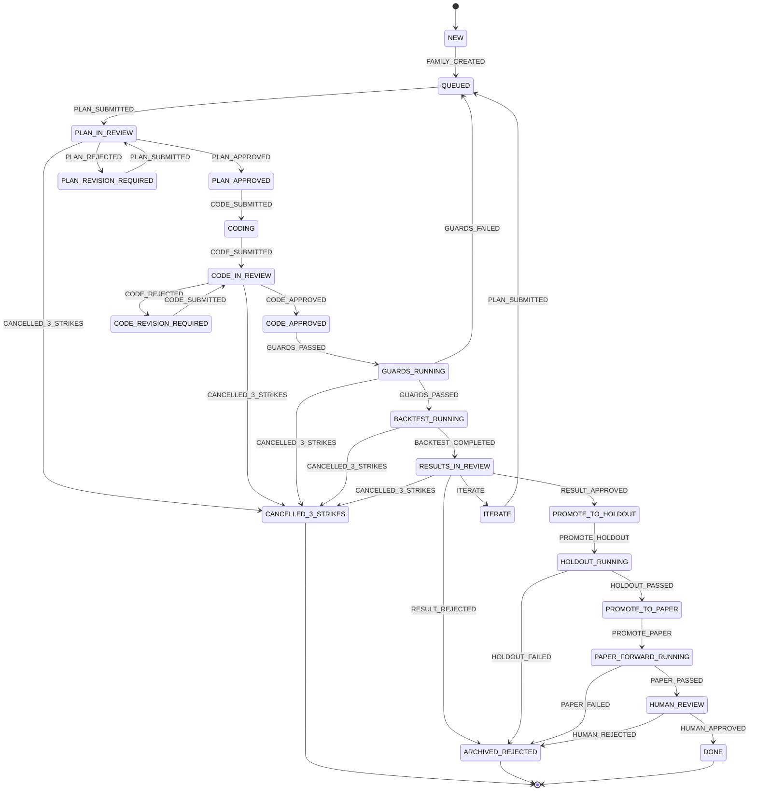
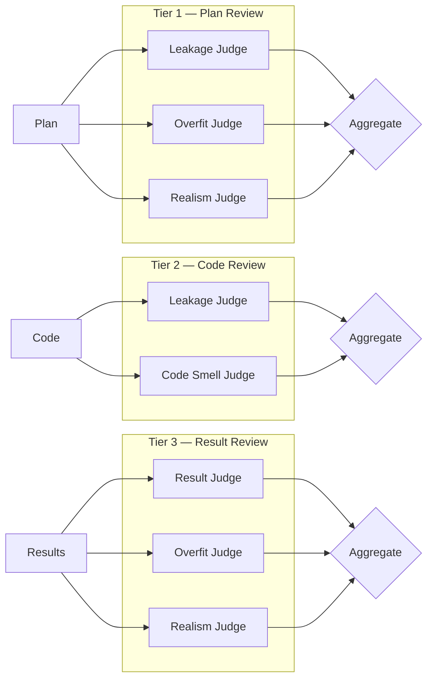

<p align="center">
  
</p>

<h3 align="center">Adversarial, Mutation-Bounded Crypto Alpha Research Loop</h3>

<p align="center">
  <em>File-native state &bull; Tiered LLM judges &bull; Deterministic guards &bull; 3-strikes cancellation</em>
</p>

---

Alpha Forge is an autonomous research system that discovers, validates, and hardens crypto trading strategies through an adversarially-reviewed, mutation-bounded pipeline. Every idea is stress-tested by 7 specialized LLM judges, 5 deterministic guards, and a robustness battery before it can graduate. All state lives in Markdown + YAML files. No database. No black boxes.

## Why Alpha Forge?

Manual quant research suffers from three failure modes:

1. **Unconstrained search** - researchers keep tweaking until something "works"
2. **Overfitting** - results look great on training data, die on holdout
3. **No audit trail** - impossible to trace how a strategy evolved

Alpha Forge addresses all three by treating alpha research as a **controlled experiment** with hard boundaries on what can change, adversarial review at every stage, and a complete paper trail in human-readable files.

## Architecture

```
                         ┌─────────────────────┐
                         │   Seed Intake        │
                         │  (papers, tweets,    │
                         │   blog posts)        │
                         └─────────┬────────────┘
                                   │
                         ┌─────────▼────────────┐
                         │  Distillation (LLM)   │
                         │  → SeedCard           │
                         └─────────┬────────────┘
                                   │
                         ┌─────────▼────────────┐
                         │  Seed Judge           │
                         │  accept / reject /    │
                         │  narrow / merge       │
                         └─────────┬────────────┘
                                   │
                    ┌──────────────▼──────────────┐
                    │       Family Created         │
                    │  (hypothesis + mechanism +   │
                    │   mutation budget)            │
                    └──────────────┬──────────────┘
                                   │
            ┌──────────────────────▼──────────────────────┐
            │              ITERATION LOOP                  │
            │                                              │
            │  ┌──────────┐    ┌───────────┐               │
            │  │ Draft     │───▶ Tier-1     │               │
            │  │ Plan      │    │ Judges    │               │
            │  └──────────┘    │ (plan)     │               │
            │                  └─────┬─────┘               │
            │                        │                     │
            │  ┌──────────┐    ┌─────▼─────┐               │
            │  │ Write     │───▶ Tier-2     │               │
            │  │ Code      │    │ Judges    │               │
            │  └──────────┘    │ (code)     │               │
            │                  └─────┬─────┘               │
            │                        │                     │
            │  ┌──────────────────┐  │                     │
            │  │ Deterministic    │◀─┘                     │
            │  │ Guards (5x)      │                        │
            │  └────────┬─────────┘                        │
            │           │                                  │
            │  ┌────────▼─────────┐                        │
            │  │ Backtest          │                        │
            │  │ (crypto-pegasus)  │                        │
            │  └────────┬─────────┘                        │
            │           │                                  │
            │  ┌────────▼─────────┐                        │
            │  │ Robustness        │                        │
            │  │ Battery (5 tests) │                        │
            │  └────────┬─────────┘                        │
            │           │                                  │
            │  ┌────────▼─────────┐    ┌────────────────┐  │
            │  │ Tier-3 Judges    │───▶│ Score &        │  │
            │  │ (results)        │    │ Decide         │  │
            │  └──────────────────┘    └───────┬────────┘  │
            │                                  │           │
            │          ┌───────────────────────┼───────┐   │
            │          │                       │       │   │
            │     Strike added            Qualified   Reject│
            │     (iterate)             improvement        │
            │          │                       │           │
            └──────────┼───────────────────────┼───────────┘
                       │                       │
                       ▼                       ▼
                 3 strikes?              Holdout → Paper
                 → CANCELLED             → Human Review
                                         → DONE
```

## Family Lifecycle — State Machine

Every research family moves through a deterministic state machine with 20 states and 31 legal transitions. Invalid transitions are rejected. Strike accumulation can override any transition to `CANCELLED_3_STRIKES`.



## Tiered Judge Pipeline

Seven adversarial LLM judges organized in three tiers, each with structured JSON output schemas:



| Judge | Focus | Risk Fields |
|-------|-------|-------------|
| **Seed Judge** | Screen raw ideas for testability, mechanism coherence, duplication | `testability`, `mechanism_coherence`, `data_availability`, `scope_discipline`, `duplication_risk`, `overfit_bait_risk` |
| **Leakage Judge** | Time leakage, label leakage, split contamination, join safety | `leakage_risk`, `time_leakage_risk`, `label_leakage_risk`, `split_contamination_risk`, `join_leakage_risk`, `cache_contamination_risk` |
| **Overfit Judge** | Result-chasing, hidden sweeps, degrees of freedom, family drift | `overfit_risk`, `search_abuse_risk`, `degrees_of_freedom_risk`, `family_drift_risk`, `mechanism_discipline` |
| **Realism Judge** | Fee realism, turnover, liquidity, slippage, latency | `realism_risk`, `cost_risk`, `slippage_risk`, `turnover_risk`, `liquidity_risk`, `latency_risk` |
| **Code Smell Judge** | Hidden state, complexity creep, edit surface violations, traceability | `code_risk`, `complexity_risk`, `statefulness_risk`, `edit_surface_violation_risk`, `traceability_risk` |
| **Result Judge** | Concentration, fragility, stability, promotion worthiness | `result_quality`, `stability`, `concentration_risk`, `cost_fragility_risk`, `perturbation_fragility_risk` |
| **Mutation Judge** | Mechanism preservation, search abuse, budget discipline, fork detection | `mechanism_coherence`, `search_abuse_risk`, `degrees_of_freedom_risk`, `family_preservation_confidence`, `budget_status` |

All risk fields use `low` / `medium` / `high` string levels. Verdicts: `approve`, `approve_with_constraints`, `revise`, `reject`, `fork_required`.

## Deterministic Guards

Five hard guards run before every backtest. No LLM — pure code checks:

| Guard | What it Checks | Violation Severity |
|-------|---------------|-------------------|
| **Edit Surface** | Only `research/*.py` files were modified; forbidden files untouched | **Red strike** |
| **Time Integrity** | No forward-looking operations (`shift(-N)` with N>0), no future data in features | Strike |
| **Split Isolation** | Holdout data not accessed before promotion; splits immutable | Strike |
| **Config Guard** | SHA-256 hashes of `costs.yaml`, `splits.yaml`, `guardrails.yaml` unchanged | Strike |
| **Reproducibility** | Logs commit hash, config hashes, dataset version for audit trail | Informational |

## Mutation Budget System

Each family gets a finite budget for modifications. This prevents unconstrained search:

| Category | Budget | Description |
|----------|--------|-------------|
| `horizon` | 2 | Timeframe changes within a bounded set |
| `venue` | 2 | Cross-exchange portability testing |
| `representation` | 1 | Feature engineering changes |
| `combination` | 1 | Signal combination changes |
| `regime` | 1 | Regime filter additions |
| `structural` | 0 | Always requires a **fork** to a child family |

When a mutation exceeds its category budget, the Mutation Judge can recommend `fork_required` to spawn a child family instead.

## 3-Strikes Policy

- **3 regular strikes** or **2 red strikes** = family cancelled (`CANCELLED_3_STRIKES`)
- Strikes reset **only** on qualified improvement (not merely on approval)
- Red strikes are issued for severe violations (edit surface breaches, data contamination)
- Cancellation overrides any pending transition — checked after every strike update

## Installation

### Prerequisites

- Python 3.11+
- [crypto-pegasus](https://github.com/your-org/crypto-pegasus) backtest engine (sibling directory)
- Anthropic API key (`ANTHROPIC_API_KEY` env var)

### Setup

```bash
# Clone
git clone https://github.com/your-org/alpha-forge.git
cd alpha-forge

# Install alpha-forge
pip install -e .

# Install crypto-pegasus (backtest engine)
pip install -e ../crypto-pegasus

# Set API key
export ANTHROPIC_API_KEY="sk-ant-..."
```

## Usage

### 1. Initialize Workspace

Creates the `alpha_research/` directory tree with global state files and auto-detects data splits from available market data:

```bash
python scripts/init_workspace.py --workspace alpha_research --configs configs --auto-splits
```

This creates:

```
alpha_research/
├── STATE.md              # Global orchestrator state
├── IDEAS.md              # Seed ideas index
├── STRIKES.md            # Global strike ledger
├── inbox/                # Raw seeds
├── seeds/                # Distilled seed cards
│   ├── pending/
│   ├── accepted/
│   └── rejected/
├── families/             # One directory per family
│   └── <family_id>/
│       ├── FAMILY.md     # Family state + metadata
│       ├── HISTORY.md    # Append-only iteration log
│       ├── research/     # The 4 editable files
│       ├── iterations/   # Per-iteration state
│       ├── artifacts/    # JSON backtest/robustness results
│       └── ledger/       # Per-iteration verdicts
└── reports/              # Generated reports
```

### 2. Ingest a Seed Idea

Feed a raw research claim from a paper, tweet, or observation:

```bash
python scripts/intake_seed.py \
  --text "Funding rate mean-reversion on perpetual futures shows a 3-5 day half-life" \
  --source "Academic paper: Perpetual Futures Microstructure" \
  --workspace alpha_research \
  --auto-create
```

This will:
1. Save the raw seed to `inbox/`
2. Distill it into a structured `SeedCard` via LLM
3. Screen it with the Seed Judge (accept / reject / narrow / merge)
4. If accepted and `--auto-create` is set, create a new family

### 3. Run a Single Iteration

Drive one family through the full pipeline (plan → judge → code → judge → guards → backtest → robustness → judge → score):

```bash
python scripts/run_iteration.py --family fam_001 --workspace alpha_research --configs configs
```

### 4. Run the Full Loop

Let the orchestrator drive a family through multiple iterations until it reaches a terminal or waiting state:

```bash
python scripts/run_loop.py \
  --family fam_001 \
  --workspace alpha_research \
  --configs configs \
  --max-iterations 10 \
  --verbose
```

### 5. Manual Operations

```bash
# Run guards independently
python scripts/run_guards.py --family fam_001 --workspace alpha_research

# Run a standalone backtest
python scripts/run_backtest.py --family fam_001 --workspace alpha_research --split validation

# Run holdout evaluation (after promotion)
python scripts/run_holdout.py --family fam_001 --workspace alpha_research

# Manually apply a state transition
python scripts/update_state.py --family fam_001 --event HUMAN_APPROVED --workspace alpha_research
```

## Research File Contracts

Each family gets 4 editable Python files in `research/`. These are the **only** files the system is allowed to modify:

| File | Required Export | Signature |
|------|----------------|-----------|
| `features.py` | `compute_features` | `(bars: pd.DataFrame) -> pd.DataFrame` |
| `labels.py` | `compute_labels` | `(bars: pd.DataFrame) -> pd.Series` |
| `model_config.py` | `MODEL_CONFIG` | `dict` |
| `signal_combiner.py` | `combine_signals` | `(features: pd.DataFrame, config: dict) -> pd.Series` |

**Signal contract**: Values must be `1.0` (long), `-1.0` (short), `0.0` (flat), or `NaN` (warmup).

**Available bar columns**: `open`, `high`, `low`, `close`, `volume`, `buy_volume`, `vwap`, `trade_count`

**Rules**:
- No forward-looking operations (`shift(-N)` with N > 0)
- No external data sources or database access
- Only `pandas` and `numpy` for computations

## Composite Scoring

Strategies are scored across multiple dimensions:

```
total = alpha_quality + stability_bonus
      - turnover_penalty - drawdown_penalty
      - concentration_penalty - fragility_penalty
```

| Component | Formula |
|-----------|---------|
| `alpha_quality` | `0.5 * avg_sharpe + 0.3 * avg_sortino + 0.2 * avg_return` |
| `stability_bonus` | `max(0, 0.2 - sharpe_variance)` |
| `turnover_penalty` | `max(0, (avg_trades - 500) / 500 * 0.1)` |
| `drawdown_penalty` | `max(0, (avg_drawdown - 0.3) / 0.3 * 0.2)` |
| `concentration_penalty` | `max(0, (max_return_share - 0.5) * 0.2)` |
| `fragility_penalty` | `robustness_fail_rate * 0.3` |

**Qualified improvement** requires: score exceeds prior best by `0.05`, robustness tests pass, and no major stability dimension worsens.

## Robustness Battery

Five stress tests run after every backtest:

| Test | What it Does |
|------|-------------|
| **Cost perturbation** | Re-run with 2x and 3x fee rates |
| **Slippage perturbation** | Re-run with 2x and 3x slippage |
| **Sub-period stability** | Split validation into 3 windows, check consistency |
| **Leave-one-asset-out** | Remove each symbol, check edge survives |
| **Shuffle placebo** | Randomize signal timing, verify alpha disappears |

## Configuration

### `configs/universe.yaml`

```yaml
symbols:
  - ETHUSDT
  - BTCUSDT
  - SOLUSDT
  - BNBUSDT
default_timeframe: "5min"
```

### `configs/costs.yaml`

```yaml
fee_rate: 0.001          # 10 bps per side (taker)
slippage_bps: 5.0        # 5 bps slippage estimate
initial_capital: 100000.0
```

### `configs/guardrails.yaml`

```yaml
min_sharpe: 0.5
min_profit_factor: 1.2
max_drawdown: 0.30
min_win_rate: 0.35
min_total_trades: 30
max_concentration_share: 0.60
cost_multiplier_tests: [2.0, 3.0]
slippage_multiplier_tests: [2.0, 3.0]
min_robustness_pass_rate: 0.7
max_strikes: 3
max_red_strikes: 2
qualified_improvement_threshold: 0.05
```

## Project Structure

```
alpha-forge/
├── alpha_forge/
│   ├── app/
│   │   ├── agents/          # LLM judges + researcher agent
│   │   │   ├── base_judge.py
│   │   │   ├── judge_seed.py
│   │   │   ├── judge_leakage.py
│   │   │   ├── judge_overfit.py
│   │   │   ├── judge_realism.py
│   │   │   ├── judge_code.py
│   │   │   ├── judge_result.py
│   │   │   ├── judge_mutation.py
│   │   │   ├── judge_router.py
│   │   │   ├── researcher.py
│   │   │   └── llm_client.py
│   │   ├── domain/           # Enums, models, scoring, strikes, mutation policy
│   │   │   ├── states.py
│   │   │   ├── events.py
│   │   │   ├── models.py
│   │   │   ├── scoring.py
│   │   │   ├── strikes.py
│   │   │   └── mutation_policy.py
│   │   ├── guards/           # Deterministic guard checks
│   │   │   ├── check_edit_surface.py
│   │   │   ├── timestamp_guard.py
│   │   │   ├── split_guard.py
│   │   │   ├── config_guard.py
│   │   │   ├── reproducibility_guard.py
│   │   │   └── runner.py
│   │   ├── storage/          # File-based state persistence
│   │   │   ├── markdown_store.py
│   │   │   └── artifact_store.py
│   │   └── workflow/         # Orchestration + state transitions
│   │       ├── transitions.py
│   │       ├── seed_flow.py
│   │       ├── family_flow.py
│   │       └── orchestrator.py
│   ├── engine/               # crypto-pegasus bridge
│   │   ├── research_strategy.py
│   │   ├── backtest_runner.py
│   │   ├── robustness_runner.py
│   │   └── holdout_runner.py
│   └── templates/research/   # Stub templates for new families
├── configs/                  # Immutable configuration
├── judges/prompts/           # Judge prompt templates
├── scripts/                  # CLI entry points
└── CLAUDE.md                 # AI assistant instructions
```

## Key Design Principles

- **File-native state** — All state in Markdown + YAML + JSON. `git log` is the audit trail.
- **Deterministic transitions** — A static transition table governs all state changes. No implicit transitions.
- **Locked edit surface** — Only 4 research files can be modified. Everything else is immutable per-iteration.
- **Adversarial review** — Every plan, implementation, and result is reviewed by multiple skeptical judges.
- **Mutation budgets** — Finite budget per mutation category prevents unconstrained parameter search.
- **Separation of concerns** — The researcher generates, judges evaluate, guards enforce, the orchestrator manages.
- **Qualified improvement only** — Strikes reset only when the strategy actually gets meaningfully better.

## License

MIT
